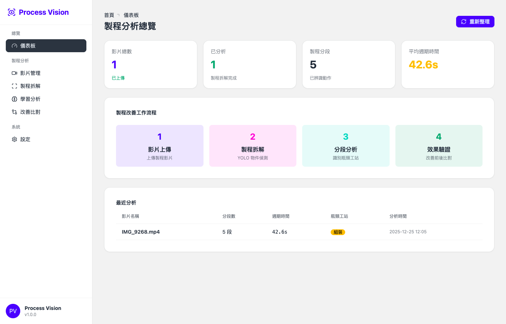
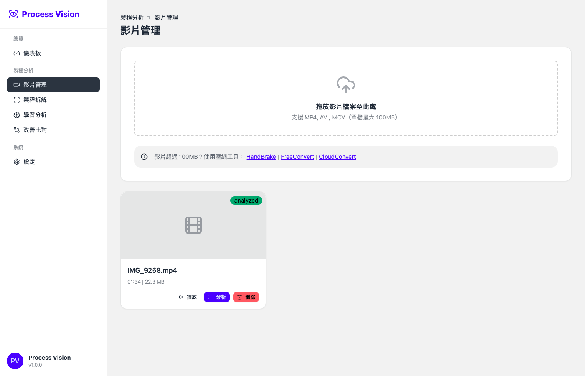
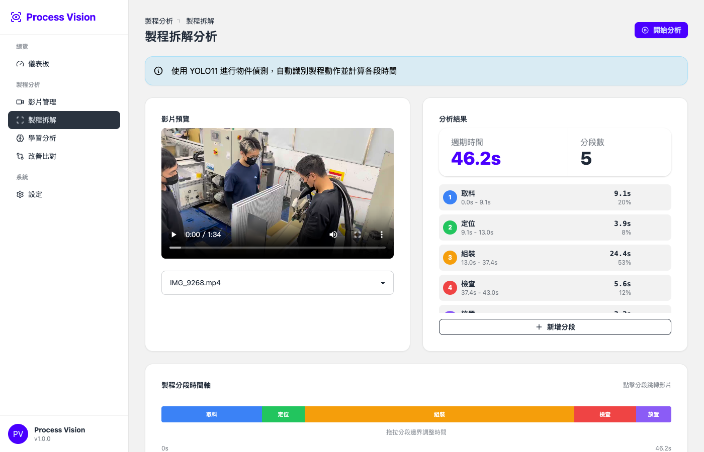
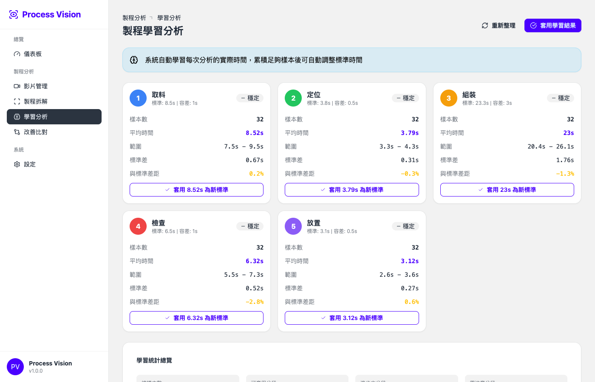
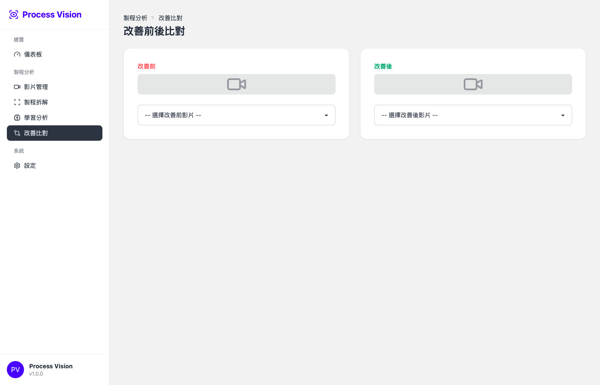

# Process Vision

AI-powered manufacturing process analysis system using YOLO11 object detection.

製程視覺 - 使用 YOLO11 物件偵測的 AI 製程分析系統

工程ビジョン - YOLO11物体検出を使用したAI製造工程分析システム

---

## Features | 功能 | 機能

### Video Management | 影片管理 | 動画管理
- Upload manufacturing process videos | 上傳製程影片 | 製造工程動画のアップロード
- Cloudinary video storage | Cloudinary 雲端儲存 | Cloudinaryクラウドストレージ
- Auto-compression for large files | 大檔案自動壓縮 | 大容量ファイルの自動圧縮

### Process Analysis | 製程分析 | 工程分析
- AI-powered segment detection | AI 自動分段偵測 | AI自動セグメント検出
- Cycle time calculation | 週期時間計算 | サイクルタイム計算
- Visual timeline editor | 視覺化時間軸編輯 | ビジュアルタイムラインエディター
- Drag-to-adjust segment boundaries | 拖拉調整分段邊界 | ドラッグでセグメント境界調整

### Learning & Improvement | 學習改善 | 学習・改善
- Statistical analysis of segments | 分段統計分析 | セグメント統計分析
- Before/After comparison | 改善前後比對 | 改善前後の比較
- Automatic learning from corrections | 從修正中自動學習 | 修正からの自動学習

---

## Tech Stack | 技術架構 | 技術スタック

| Layer | Technology |
|-------|------------|
| Frontend | Vue 3 + DaisyUI + Tailwind CSS |
| Backend | FastAPI + SQLModel |
| Database | Neon PostgreSQL |
| Video Storage | Cloudinary |
| AI Engine | Google Gemini |
| Deployment | Vercel (Frontend) + Render (Backend) |

---

## Screenshots | 截圖 | スクリーンショット

### Dashboard | 儀表板 | ダッシュボード
Overview of all analyzed videos and statistics.



### Video Management | 影片管理 | 動画管理
Upload and manage manufacturing process videos.



### Process Analysis | 製程拆解 | 工程分析
AI-powered segment detection with visual timeline editor.



### Learning Analytics | 學習分析 | 学習分析
Statistical analysis and trend detection for continuous improvement.



### Comparison | 改善比對 | 改善比較
Side-by-side comparison of before/after processes.



---

## Quick Start | 快速開始 | クイックスタート

```bash
# Clone repository
git clone https://github.com/seikaikyo/smai-process-vision.git
cd smai-process-vision

# Open in browser (static site)
open index.html

# Or deploy to Vercel
vercel
```

---

## API Endpoints | API 端點 | APIエンドポイント

| Method | Endpoint | Description |
|--------|----------|-------------|
| GET | `/api/aoi/videos` | List all videos |
| POST | `/api/aoi/videos` | Upload video |
| DELETE | `/api/aoi/videos/{id}` | Delete video |
| POST | `/api/aoi/videos/{id}/analyze` | Analyze video |
| PUT | `/api/aoi/videos/{id}/analysis` | Update analysis results |
| GET | `/api/aoi/pv/dashboard` | Dashboard stats |

---

## Environment Variables | 環境變數 | 環境変数

```env
# Backend (Render)
DATABASE_URL=postgresql://...
CLOUDINARY_CLOUD_NAME=...
CLOUDINARY_API_KEY=...
CLOUDINARY_API_SECRET=...
GOOGLE_GENAI_API_KEY=...
```

---

## License | 授權 | ライセンス

MIT License

---

## Author | 作者 | 著者

**Dash Kyo** - [GitHub](https://github.com/seikaikyo)

Built with Claude Code
