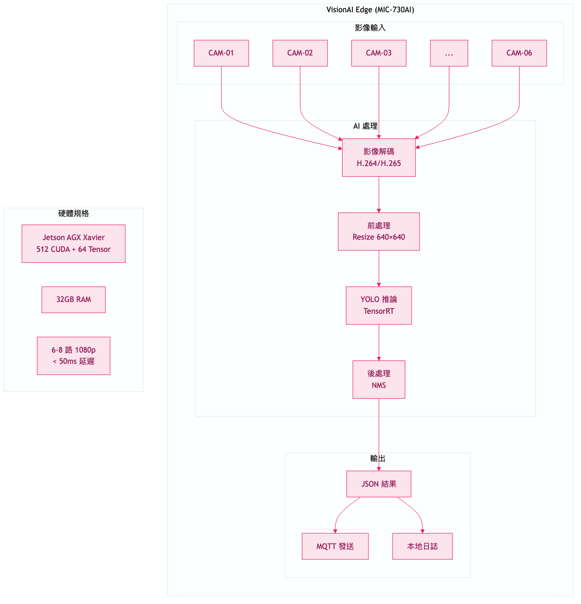

# 圖表附錄

## 製程視覺 AI 分析系統

**文件編號**: SMAI-DIA-2024-001
**日期**: 2024-01-15

---

## 圖表目錄

1. 系統整體架構圖
2. 資料流架構圖
3. 整合架構圖
4. VisionAI Edge 詳細架構
5. 分析流程圖
6. 硬體設備比較

---

## 圖 1：系統整體架構圖


**說明**：
- OT 網路：20 台 IPCam 連接 4-6 台 VisionAI Edge
- IT 網路：WISE-IoTSuite 數據中台 + Mac 分析伺服器
- 資料流向：攝影機 → Edge 推論 → MQTT → IoTSuite → Mac

---

## 圖 2：資料流架構圖


**說明**：
- **即時分析**：Edge 推論 < 100ms，MQTT 推送到 IoTSuite
- **批次分析**：錄影檔上傳到 Mac，YOLO 分析後回寫 IoTSuite
- **學習統計**：DataInsight 整合多源資料，產出報表

---

## 圖 3：整合架構圖


**說明**：
- **資料來源**：VisionAI、MES、ERP、Sensor
- **數據中台**：WISE-IoTSuite 負責資料整合
- **DataInsight**：ETL 處理，建立主題資料庫
- **輸出應用**：Dashboard、Process Vision、REST API

---

## 圖 4：VisionAI Edge 詳細架構



**說明**：
- **輸入**：最多 6 路攝影機 (MIC-730AI)
- **處理**：H.264 解碼 → 前處理 → TensorRT 推論 → NMS
- **輸出**：JSON 結果透過 MQTT 發送

---

## 圖 5：分析流程圖


**說明**：
1. 上傳影片到 Cloudinary
2. 觸發 YOLO 分析
3. 每 5 幀進行物件偵測
4. 偵測場景變化，判定分段邊界
5. 分類分段類型
6. 儲存結果並更新學習統計

---

## 圖 6：硬體設備比較


**說明**：

### Mac 設備推薦

| 設備 | 適用場景 | 價格 |
|------|---------|------|
| Mac mini M4 | Web Server | NT$19,900 起 |
| **Mac Studio M2 Max** | **分析 + 訓練 (推薦)** | **NT$63,900 起** |
| Mac Studio M2 Ultra | 大規模訓練 | NT$129,900 起 |

### VisionAI Edge 推薦

| 設備 | 處理能力 | 價格 |
|------|---------|------|
| MIC-730AI | 6-8 路 1080p | NT$150,000 |
| MIC-720AI | 3-4 路 1080p | NT$80,000 |

---

## 使用說明

這些圖片可直接插入到 Word 文件中：

1. 在 Word 中選擇「插入 → 圖片」
2. 選擇 `docs/diagrams/` 資料夾中的 PNG 檔案
3. 調整圖片大小和位置

圖片檔案位置：
```
docs/diagrams/
├── 01-system-architecture.png
├── 02-data-flow.png
├── 03-integration-architecture.png
├── 04-edge-detail.png
├── 05-analysis-flow.png
└── 06-hardware-comparison.png
```
