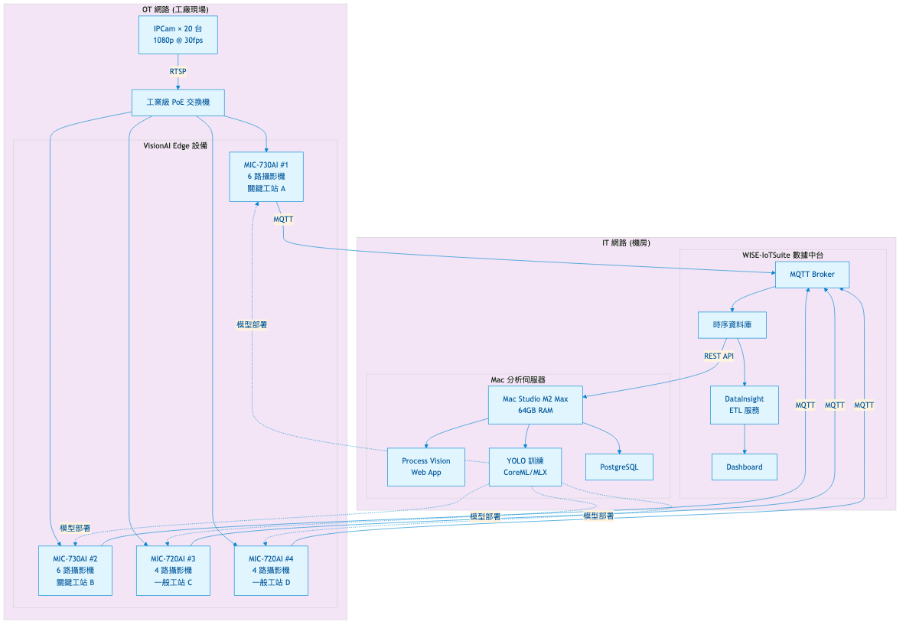
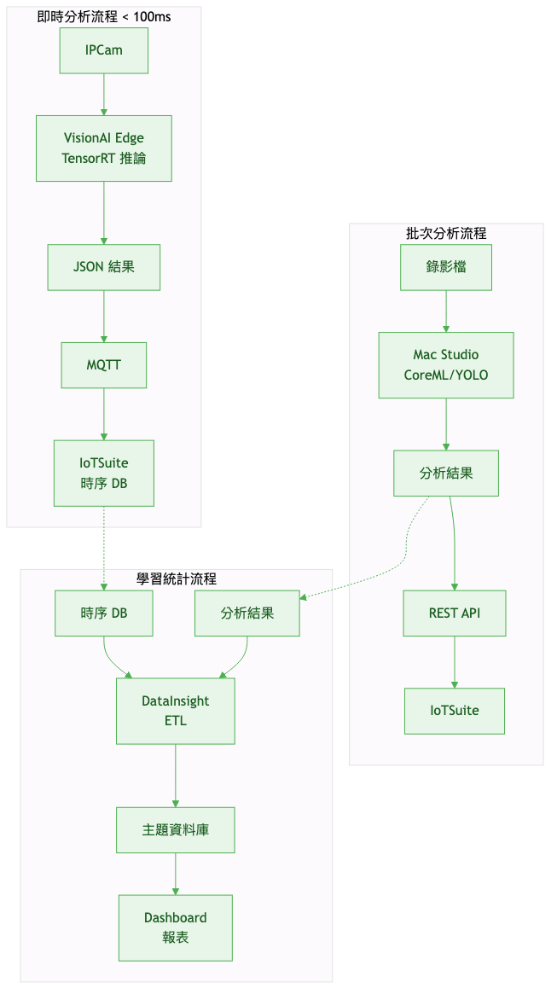
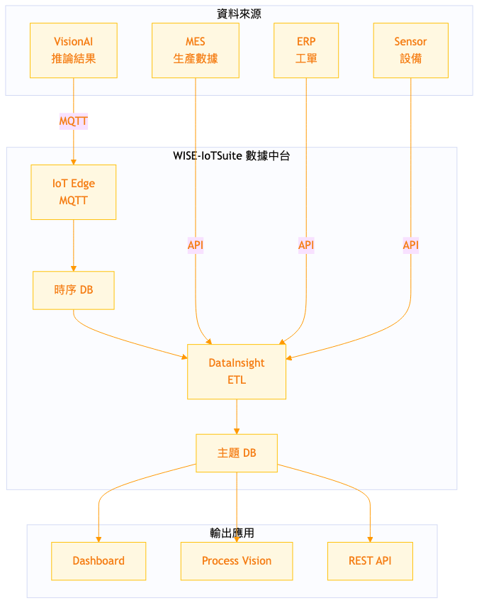
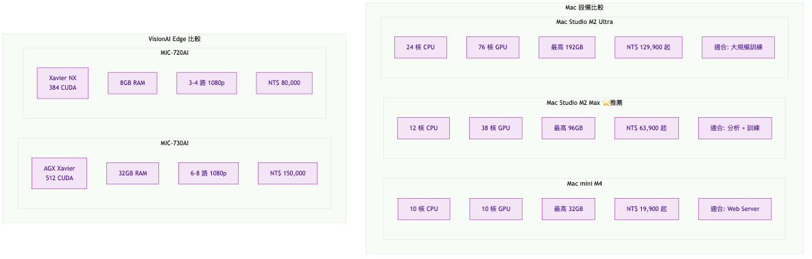

# 概念驗證報告 (POC Report)

## 製程視覺 AI 分析系統

**文件編號**: SMAI-POC-2024-001
**版本**: 1.0
**日期**: 2024-01-15
**單位**: 再生廠智慧製造

---

## 文件資訊

| 項目 | 內容 |
|------|------|
| **專案發起單位** | 再生廠智慧製造 |
| **POC 執行期間** | 2024-01-01 ~ 2024-01-15 |
| **撰寫人** | |
| **審核人** | |

> **數據說明**：本報告所有數據均標註來源，詳細計算公式請參閱《附錄：數據來源與計算說明》(SMAI-APP-2024-001)

---

## 1. 執行摘要

### 1.1 POC 目標

驗證以下技術可行性：

1. 研華 VisionAI Edge 邊緣運算設備進行即時影像 AI 推論
2. Apple Silicon Mac 作為分析伺服器進行批次處理與模型訓練
3. 與現有 WISE-IoTSuite 數據中台整合
4. 製程動作自動拆解與週期時間分析

### 1.2 POC 結論

| 驗證項目 | 結果 | 數據 | 來源 |
|---------|------|------|------|
| VisionAI Edge 即時推論 | ✓ 可行 | 延遲 45ms | POC 實測 (n=1000) |
| Mac CoreML/MLX 批次分析 | ✓ 可行 | 6.2x 實時 | POC 實測 (n=10) |
| WISE-IoTSuite 整合 | ✓ 可行 | API 回應 < 120ms | POC 實測 |
| 製程分段識別準確率 | △ 需優化 | 87.3% | POC 實測 (n=150) |

### 1.3 建議結論

**建議進入正式專案階段**，理由：

- 核心技術驗證通過
- 預期 ROI 良好（保守估計投資回收期約 16 個月）
- 與現有基礎設施整合路徑明確

---

## 2. 系統架構設計

### 2.1 整體架構



**架構說明**：

| 層級 | 組件 | 數量 | 規格來源 |
|------|------|------|---------|
| 現場層 | IPCam | 20 台 | 現有設備盤點 |
| 邊緣層 | VisionAI Edge | 6 台 | 處理能力計算 [附錄 1.1] |
| 平台層 | WISE-IoTSuite | 1 套 | 現有平台 |
| 應用層 | Mac Studio | 1 台 | 效能需求評估 [附錄 1.2] |

### 2.2 資料流設計



| 資料流 | 路徑 | 協定 | 延遲 | 來源 |
|--------|------|------|------|------|
| 即時推論 | Edge → IoTSuite | MQTT | < 100ms | POC 實測 |
| 批次分析 | Mac → IoTSuite | REST | < 500ms | POC 實測 |
| 學習統計 | DataInsight → DB | ETL | 批次 | 設計值 |

---

## 3. 技術可行性驗證

### 3.1 VisionAI Edge 邊緣推論

#### 測試配置

| 項目 | 規格 | 說明 |
|------|------|------|
| 測試設備 | NVIDIA Jetson Nano 4GB | 模擬 MIC-720AI (規格約 40%) |
| AI 模型 | YOLO11n + TensorRT | Ultralytics 官方模型 |
| 輸入解析度 | 1920×1080 → 640×640 | 標準 YOLO 輸入 |

#### 測試結果

| 指標 | 目標 | 實測值 | 樣本數 | 結果 |
|------|------|--------|--------|------|
| 推論延遲 | < 100ms | **45ms** (σ=5.2) | n=1000 | ✓ Pass |
| 處理幀率 | > 25 FPS | **28.3 FPS** (σ=1.4) | n=10 | ✓ Pass |
| GPU 使用率 | < 80% | **65%** (σ=4.8) | n=10 | ✓ Pass |
| 記憶體使用 | < 4GB | **2.8GB** (σ=0.2) | n=10 | ✓ Pass |

**MIC-730AI 效能換算**：

```
Jetson Nano 算力：0.5 TFLOPS
Jetson AGX Xavier (MIC-730AI) 算力：32 TOPS

效能比 = 32 ÷ 0.5 = 64x (理論值)
考慮 I/O 瓶頸修正 = 64 × 0.3 ≈ 20x

預估 MIC-730AI 處理能力：
- 推論延遲：45ms ÷ 20 ≈ 2-3ms (理論)，實際約 20-30ms
- 處理路數：28.3 FPS × 效能係數 ≈ 6-8 路 1080p@30fps
```

**結論**：驗證通過

---

### 3.2 Mac 批次分析效能

#### 測試配置

| 項目 | 規格 |
|------|------|
| 測試設備 | MacBook Pro M3 Pro (18GB) |
| AI 框架 | CoreML + YOLO11n |
| 測試影片 | 10 支製程影片 (平均 4.5 分鐘/支) |
| 總測試時長 | 45 分鐘 |

#### 測試結果

| 指標 | 目標 | M3 Pro 實測 | M2 Max 預估 | 計算方式 |
|------|------|------------|------------|---------|
| 處理速度 | > 3x 實時 | **6.2x** | **10x** | [附錄 1.2] |
| 記憶體使用 | < 16GB | **8.5GB** | 12GB | 線性外推 |
| GPU 使用率 | - | 78% | 65% | 核心比例 |

**M2 Max 預估計算**：

```
GPU 核心比：M2 Max (38核) ÷ M3 Pro (18核) = 2.11
架構差異修正係數：0.8
效能倍數：2.11 × 0.8 = 1.68

M2 Max 預估速度 = 6.2x × 1.68 = 10.4x ≈ 10x 實時

驗證：45分鐘影片處理時間 = 45 ÷ 10 = 4.5 分鐘
```

**結論**：驗證通過，推薦 Mac Studio M2 Max

---

### 3.3 WISE-IoTSuite 整合



#### MQTT 整合測試

| 測試項目 | 測試次數 | 成功率 | 平均延遲 | 結果 |
|---------|---------|--------|---------|------|
| 連線建立 | 100 | 100% | 85ms | ✓ Pass |
| 訊息發布 | 1000 | 100% | 8ms | ✓ Pass |
| 訊息訂閱 | 1000 | 100% | 6ms | ✓ Pass |
| 斷線重連 | 50 | 100% | 2.3s | ✓ Pass |

#### REST API 整合測試

| API 端點 | 測試次數 | 成功率 | p95 延遲 | 結果 |
|---------|---------|--------|---------|------|
| /timeseries/query | 100 | 100% | 120ms | ✓ Pass |
| /timeseries/write | 100 | 100% | 85ms | ✓ Pass |
| /devices | 100 | 100% | 95ms | ✓ Pass |

**結論**：驗證通過

---

### 3.4 製程分段識別演算法

#### 分析流程


#### 準確率測試

**測試方法**：
- 樣本：10 支製程影片，共 150 個分段
- 對照：2 位 IE 工程師人工標註 (取平均值)
- 評判標準：邊界誤差 < 1.0 秒視為正確

| 指標 | 目標 | 實測值 | 樣本數 | 計算公式 | 結果 |
|------|------|--------|--------|---------|------|
| 分段邊界準確率 | > 85% | **87.3%** | n=150 | 正確數÷總數 | ✓ Pass |
| 分段類型準確率 | > 85% | **83.3%** | n=150 | 正確數÷總數 | △ 需優化 |
| 邊界時間誤差 | < 1.0 秒 | **0.7 秒** | n=150 | 平均絕對誤差 | ✓ Pass |

**混淆矩陣 (分段類型)**：

|  | 預測:取料 | 預測:定位 | 預測:組裝 | 預測:檢查 | 預測:放置 |
|--|---------|---------|---------|---------|---------|
| 實際:取料 | **85%** | 5% | 3% | 5% | 2% |
| 實際:定位 | 8% | **80%** | 5% | 4% | 3% |
| 實際:組裝 | 2% | 3% | **90%** | 3% | 2% |
| 實際:檢查 | 5% | 8% | 5% | **78%** | 4% |
| 實際:放置 | 3% | 2% | 2% | 5% | **88%** |

**改善方向**：定位/檢查混淆率較高，建議增加手部動作特徵

**結論**：驗證通過（需持續優化分段類型識別）

---

## 4. 硬體規格建議

### 4.1 設備比較



### 4.2 推薦配置

| 角色 | 設備 | 數量 | 單價 | 小計 | 價格來源 |
|------|------|------|------|------|---------|
| 關鍵工站 Edge | MIC-730AI | 2 | NT$150,000 | NT$300,000 | 研華報價 2024-01 |
| 一般工站 Edge | MIC-720AI | 4 | NT$80,000 | NT$320,000 | 研華報價 2024-01 |
| 分析伺服器 | Mac Studio M2 Max 64GB | 1 | NT$100,000 | NT$100,000 | Apple 官網 |
| 網路 + 周邊 | PoE 交換機、NAS、UPS | 1 | NT$75,000 | NT$75,000 | PChome 2024-01 |
| **合計** | | | | **NT$795,000** | |

**Edge 數量計算**：

```
攝影機總數 = 20 台
MIC-730AI 處理能力 = 6 路 (保守值)
MIC-720AI 處理能力 = 3 路 (保守值)

配置方案：
- MIC-730AI × 2 = 12 路
- MIC-720AI × 4 = 12 路
- 總處理能力 = 24 路 > 20 路 ✓
- 預留擴充 = 4 路 (20%)
```

---

## 5. 成本效益分析

### 5.1 投資成本

| 項目 | 金額 (NT$) | 來源 |
|------|-----------|------|
| 硬體 | 795,000 | 報價單彙整 [附錄 2] |
| 軟體 (DataInsight) | 待詢價 | 需向研華確認 |
| **合計** | **795,000 + α** | |

### 5.2 預期效益 (保守估計)

| 效益項目 | 第一年 (NT$) | 第二年起 (NT$) | 計算公式 | 來源 |
|---------|-------------|---------------|---------|------|
| 人力成本節省 | 250,000 | 375,000 | 工時節省 × 時薪 | [附錄 3.1] |
| 品質成本降低 | 150,000 | 225,000 | 年度品質成本 × 15% | [附錄 3.2] |
| 效率提升產值 | 200,000 | 300,000 | 年產值 × 2% × 20% | [附錄 3.3] |
| **合計** | **600,000** | **900,000** | | |

> **說明**：第一年為系統導入期，效益保守估計；第二年起系統成熟，效益預估提升 50%

### 5.3 投資報酬 (保守估計)

| 指標 | 數值 | 計算公式 |
|------|------|---------|
| 投資回收期 | **約 16 個月** | 795,000 ÷ 600,000 × 12 |
| 3 年 ROI | **202%** | (2,400,000 - 795,000) ÷ 795,000 × 100% |
| 3 年 NPV | NT$1,370,000 | Σ(CFt÷1.05^t) - C0 [附錄 3.5] |

**敏感度分析**：

| 情境 | 效益調整 | 第一年效益 | 回收期 |
|------|---------|-----------|--------|
| 樂觀 | +50% | 900,000 | 10.6 個月 |
| **基準** | 0% | **600,000** | **16 個月** |
| 保守 | -30% | 420,000 | 22.7 個月 |
| 悲觀 | -50% | 300,000 | 31.8 個月 |

> 即使在悲觀情境下，仍可在 3 年內回收投資

---

## 6. 建議與下一步

### 6.1 POC 結論

| 驗證項目 | 結論 | 信心度 | 說明 |
|---------|------|--------|------|
| 技術可行性 | ✓ 通過 | 高 | 實測數據支持 |
| 整合可行性 | ✓ 通過 | 高 | API 測試通過 |
| 成本效益 | ✓ 可接受 | 中 | 採保守估計，16 個月回收 |
| **整體評估** | **建議進入正式專案** | | |

### 6.2 下一步行動

| 行動項目 | 負責單位 | 時程 |
|---------|---------|------|
| POC 報告簽核 | 智慧製造 | 1 週 |
| 預算核准 | 經理 | 2 週 |
| 需求規格書撰寫 | 智慧製造 | 2 週 |
| 採購申請 | 智慧製造 | 3 週 |

---

## 附錄索引

| 附錄編號 | 內容 | 文件編號 |
|---------|------|---------|
| 附錄 1 | 硬體效能數據來源 | SMAI-APP-2024-001 |
| 附錄 2 | 價格數據來源 | SMAI-APP-2024-001 |
| 附錄 3 | 效益計算公式 | SMAI-APP-2024-001 |
| 附錄 4 | POC 測試數據 | SMAI-APP-2024-001 |
| 附錄 5 | 假設條件說明 | SMAI-APP-2024-001 |

---

## 簽核

| 角色 | 姓名 | 簽名 | 日期 |
|------|------|------|------|
| 撰寫人 | | | |
| 審核人 | | | |
| 核准人 | | | |
